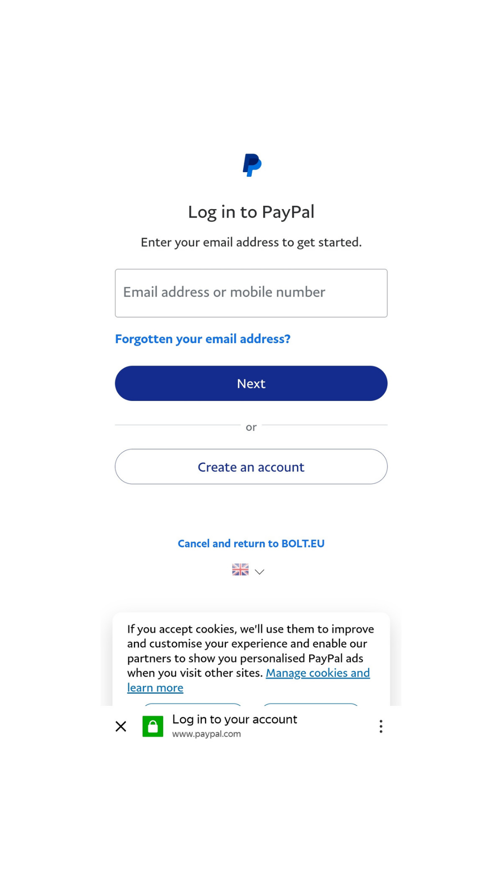

# User guide for the Bolt  app payment method selection form
For your convenience, Bolt Taxi provides several ride service programs to choose from: personal and work. These options will be useful if it is important for you to separate rides taken for work purposes from personal ones. By default, the personal trips option will work.

After adding a work profile, you will be able to switch the payment methods for trips from work to personal and vice versa, if necessary. 
## Selecting a payment method
Before ordering, open the application menu to select the payment method. Click on the first menu option "Payment" (Fig. 1):

Figure 1

Once you have clicked on the first menu option "Payment", the "Payment" screen will appear in front of you (fig. 2):

Figure 2

## Personal payment method
If you have the need to travel for a personal purpose, from the "Payment" screen, select "Add payment method" from the "Payment methods" option (fig. 3):

Figure 3

Once you have pressed the "Add payment method" option on the "Payment" screen (fig. 2), two options will appear in front of you (fig. 4):
1. **"Add debit/credit card".** To pay for your personal journey by bank card, follow the instructions provided under "Setting up your payment method" in the "Add debit/credit card" section (fig. 10). 
 2. **"Add PayPal".** If you prefer to pay for your trip via PayPal, follow the instructions presented in the section "Setting up the payment method" in the "Add PayPal" section (fig.11, 12).

Figure 4

## Working payment method
In order to select a working payment program, from the "Payment" screen, in the "Payment methods" option, click on "Set up work profile" (fig. 5):

Figure 5

## Adding a work profile
The Bolt work profile information will appear on the screen. Once you have read it, press the "Get started" button (fig.6):

Figure 6

The system will then inform you that a work profile has been created (fig. 7):

Figure 7

Once you have clicked the "Done" button, your work profile will appear in front of you. Here you need to add your company information, enter your work email and choose your payment method. Also here you can see reports on your trips and add an expense account service (fig. 8):

Figure 8

To select which way you will pay for work trips in your work profile, click "Add payment method". Two options will appear in front of you (fig. 9): 
1. **"Add debit/credit card".** To pay for your work trip by bank card, follow the instructions provided under "Set up a payment method" in the "Add debit/credit card" section (fig. 10). 
 2. **"Add PayPal".** If you prefer to pay for your trip via PayPal, follow the instructions presented in the section "Setting up the payment method" in the "Add PayPal" section (fig.11,12).
   

Figure 9

## Setting up the payment method
As we already know, there are two payment methods in the app for personal and business trips: via debit/credit card and via PayPal. Let's look at how each one works in detail. 

### Add debit/credit card
If you prefer to pay by card, click on "Add debit/credit card" in the "Add payment method" box (see fig.9 above). A form will appear in front of you to fill in your card details (fig. 10):

Figure 10

Once you have completed the form, click on the "Add card" button. As the message on the screen says, Bolt may charge your card a small amount to confirm its details. Don't worry, your card will be refunded instantly.

Once you successfully complete the validation process, your card will be linked to your Bolt app profile. You will be able to use it to pay for your trips in the app.

If you have problems adding your card, please make sure that:
1. You have entered your card details correctly.
2. You have enough funds in your bank account.
3. Your card has not expired.
4. Online transactions are available for your card.
5. You add a MasterCard or Visa card. American Express cards are accepted in Eurozone countries only.
6. From 07.03.2022 it is not possible to use cards issued by Russian banks.
### Add PayPal
If you have decided to pay for your trips via PayPal, choose "Add PayPal" option in the "Add payment method" window (see Fig. 9 above). A form for filling in your PayPal account details will appear (fig. 11):

Figure 11

To link PayPal to your Bolt account, enter your email or phone number in the form field. Click the "Next"  (fig. 11). You will be prompted by PayPal to confirm your personal details (fig. 12):

Figure 12

After successfully completing the data validation process, your PayPal account will be linked to your Bolt app profile. This will allow you to quickly pay for your trips in the app. 

## Payment method switches
Note that after adding a work profile (see fig. 5 "Working payment method" option) when selecting payment methods, the "Payment" screen will change and look slightly different. In the "Payment methods" option there will be two buttons "Personal" and "Work" that can be easily switched when you change your travel goals (fig. 13, fig. 14). 

If you choose a personal payment method, you press the "Personal" button (fig.13). The color of the selected button will change from white to green:

Figure 13

If you need to pay for a journey undertaken for work purposes, you press the adjacent "Work" button (fig. 14): 

Figure 14